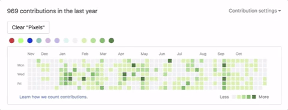

  

# Letícia Ducatti

## Machine Learning | AI Security | Cybersecurity | Data Science

Computer Science and Mathematics background focused on Data Science, Cybersecurity, and trustworthy AI, with foundations in linear algebra, probability, statistics, graph theory, and Topological Data Analysis (TDA).

I build machine learning and security projects focused on robust, interpretable, and reliable AI systems, exploring anomaly detection, model behavior, and AI safety.

Currently exploring:

- AI Security & LLM vulnerabilities
- Adversarial Machine Learning
- Anomaly Detection
- Graph Neural Networks
- Topological Data Analysis
- AI Governance

---

### Featured Projects

- SentinelAI - LLM Security & AI Guardrails Platform  
  Security and observability layer for LLM applications. A FastAPI service that provides inline guardrails for AI systems by detecting prompt injection, anomalous behavior, exposure risks, and adversarial patterns.

  
  
  
  

- NeuroScope - Transformer Interpretability Research  
  Mechanistic interpretability framework for analyzing transformer models, focusing on attention mechanisms, residual streams, logit lens projections, and circuit-level behavior in GPT-style architectures.

  
  
  

- Barcode - Topological Anomaly Detection  
  Cybersecurity anomaly detection project applying Topological Data Analysis and machine learning methods to identify abnormal patterns in network data.

  
  
  
  

- quantum-qkd-simulator - Quantum Key Distribution Simulator  
  Simulation of BB84 quantum key distribution under realistic noise models and intercept-resend attacks, with robustness analysis inspired by redundancy and stability concepts in information security systems.

  
  
  
  

- Data Breach Intelligence Dashboard  
  Cybersecurity analytics platform for exploring simulated breach patterns, risk structures, and sector-based vulnerability analysis through interactive visualization.

  
  
  
  

---

### Tech Stack

---

### Cybersecurity and Cryptography

Threat modeling, adversarial machine learning, data poisoning analysis, LLM security, encryption systems, and secure communication design.

---

### Courses and Certifications

- Data Engineering Fundamentals — Data Science Academy
- Data Science and Artificial Intelligence Fundamentals — Data Science Academy
- Introduction to Cryptography and Network Security — Saylor Academy

---

### Contact

---

  

