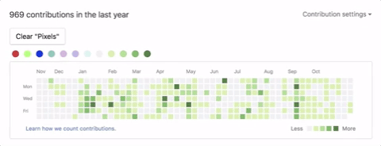

  

<table>
  <tr>
    <td style="min-width: 400px; vertical-align: top;">

### 👋 Hi there, welcome to my GitHub!

**Bachelor's Degree in Computer Science**  
Focused on Data Analysis and Cybersecurity.

Passionate about data, obsessed with finding insights, and always alert when it comes to cybersecurity.  
Sometimes I analyze data like a calm Jedi 🧘‍♀️... and other times, like a cat smashing the keyboard 🐱💥

</td>
    <td>
      
    </td>
  </tr>
</table>

---

### ⚡ Tech Stack

---

### 🛰️ Projects

- [📊 Sales Dashboard (Streamlit)](https://github.com/Leticia-Ducatti/sales-dashboard-project)  
  Interactive dashboard with KPIs, filters, and beautiful visuals using Plotly and Streamlit.

- *(coming soon)* 🔐 Password analytics & encryption project with Python and hash algorithms

---

### 📚 Courses & Certifications

- Data Engineering Fundamentals — Data Science Academy  
- Data Science & Artificial Intelligence Fundamentals — DSA  
- CS260: Introduction to Cryptography and Network Security — Saylor Academy  

---

### 📫 Let’s connect!

---

  

<h3 align="center">✨ “Do. Or do not. There is no try. Especially when analyzing data.†
<em>— Master Yoda (with a dash of Data Science wisdom)</em> 🧠⚔️</h3> 
